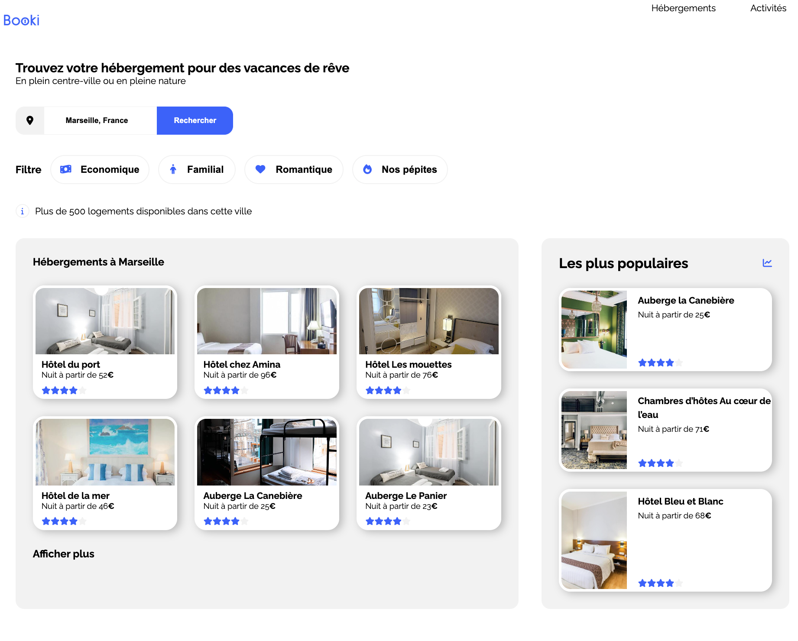
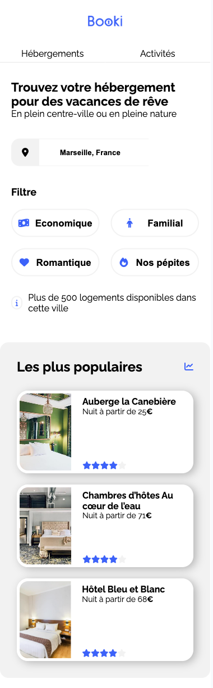

# Booki — Hotel Booking Landing Page (HTML & CSS)

## 📸 Project Preview



Booki is a responsive hotel and activity booking landing page built as part of the **OpenClassrooms “Frontend Developer” path**.  
The goal was to turn a Figma design into a pixel-perfect, accessible, and responsive web page using only **HTML and CSS**.

---

## 🌍 Live Demo
👉 https://bookifanlublou.netlify.app/

[](https://app.netlify.com/sites/bookifanlublou/deploys)


---

## 🎯 Project Objectives

- Reproduce a Figma design in **semantic HTML & modern CSS**
- Implement a fully **responsive layout** (desktop, tablet, mobile)
- Build a clear and maintainable CSS architecture
- Respect accessibility and good front-end practices
- Avoid any JavaScript: this project is **pure HTML/CSS**

---

## ✨ Features

- 🔍 **Search bar** with location icon and “Search” button
- 🧮 **Filter bar** with interactive buttons (budget, family, romantic, “hidden gems”)
- 🏨 **Accommodation section** with card grid layout
- ⭐ **Rating system** using Font Awesome star icons
- 📊 **“Most popular” section** with highlighted accommodations
- 🗺️ **Activities section** linked to Marseille landmark imagery
- 📱 Fully responsive layout:
  - desktop (1440px),
  - tablet (≤ 1024px),
  - mobile (≤ 768px)

---

## 🛠 Tech Stack

- **HTML5**
- **CSS3**
- **Flexbox**
- **CSS Grid**
- **Media Queries**
- **Google Fonts** (Raleway)
- **Font Awesome** for icons
- **VS Code** with ESLint & Prettier for formatting

---

## 🧱 Project Structure

```txt
<REPO_NAME>/
│
├── index.html
├── CSS/
│   └── style.css
├── images/
│   ├── hebergements/
│   ├── activites/
│   └── logo/
└── docs/
    └── screenshots/
        ├── booki-home-desktop.png
        ├── booki-home-tablet.png
        └── booki-home-mobile.png

```
## 🧩 Layout & CSS Architecture

### 1. Reset & Variables
- Global reset (margin, padding, box-sizing)
- CSS variables for color palette

### 2. Global Layout
- Main wrapper for centering content
- Spacing between header, sections, footer

### 3. Header
- Logo aligned left
- Navigation right-aligned with hover behavior
- Mobile: navigation becomes full-width

### 4. Filters & Search Section
- Location icon container
- Search input
- Button “Search” (desktop)
- Magnifying glass (mobile)
- Filter bar with icons & hover state
- Info bar showing number of accommodations

### 5. Accommodations Section
- 3-column grid
- Cards with image, title, price, rating
- Shadows & rounded corners

### 6. Popular Section
- Vertical stack on desktop
- Horizontal layout on tablet
- Flexbox-based alignment

### 7. Activities Section
- 4 cards on desktop
- 1 column on mobile
- Image + activity title

### 8. Footer
- 3 columns: About / Accommodations / Support
- Single column on mobile

### 9. Media Queries

#### ≤ 1024px (tablet)
- Sections stack vertically
- Popular cards in a row

#### ≤ 768px (mobile)
- Navigation full width
- Search button hidden → replaced by magnifying glass icon
- Filter grid switches to 2 columns
- Accommodations: 1 column
- Activities stacked vertically


## 📸 Screenshots

| Desktop | Tablet | Mobile |
|--------|---------|--------|
|  |  |  |

## 🚀 Getting Started

1. **Clone the repository**
  ```txt
   git clone https://github.com/Jacques-Clermont-Dev/oc-p02-booki
   cd oc-p02-booki
  ```

2. **Open the project**

You can simply open `index.html` in your browser, or use a local server (like **VS Code Live Server**):

  - Open the folder in VS Code
  - Right-click `index.html`
  - Select “Open with Live Server”

No build step is required — this is pure HTML and CSS.

## ✅ Validation & Quality
  - ✅ HTML validated with W3C HTML Validator
  - ✅ CSS validated with W3C CSS Validator
  - ✅ Layout tested on:
      - Chrome
      - Firefox
      - Safari
      - Edge
      - Mobile DevTools (iOS & Android)
  - ✅ Lighthouse checks (accessibility, best practices)

## 🔮 Possible Improvements

This project is intentionally limited to HTML/CSS, but possible next steps include:

  - Adding JavaScript to:
    - make filters functional,
    - handle real search logic.
  - Loading accommodations and activities from a JSON file.
  - Improving accessibility even more (ARIA roles, focus states).
  - Using CSS custom properties more aggressively (spacing, typography).
  - Migrating to a component-based approach (e.g. React) for a future version.

👤 Author

Jacques Clermont
Frontend developer (JavaScript / React) 
GitHub: https://github.com/Jacques-Clermont-Dev


