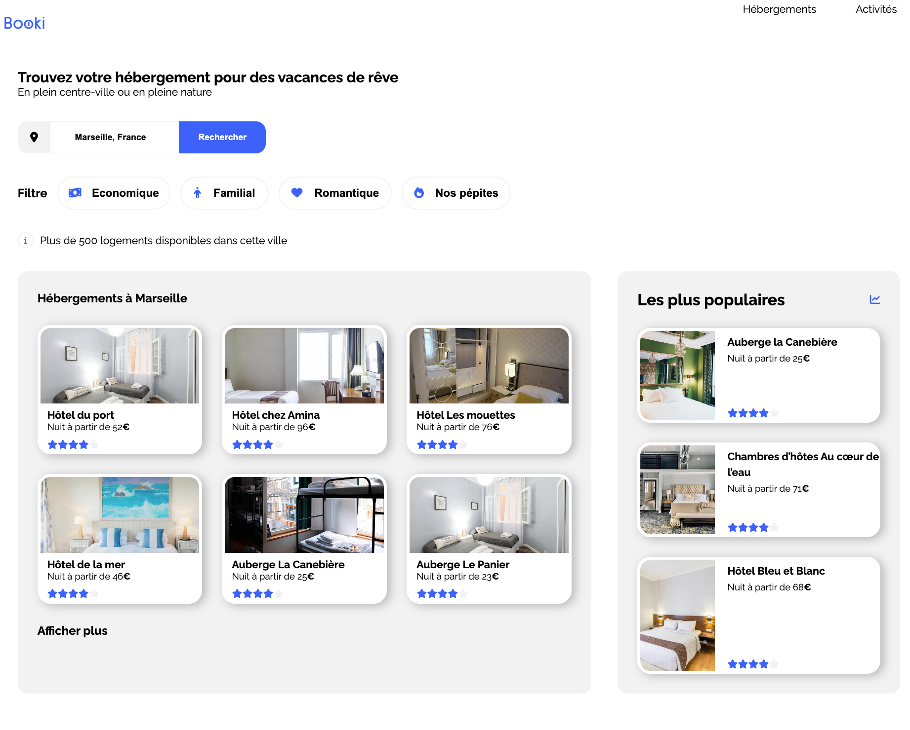

# Booki — Hotel Booking Landing Page (HTML & CSS)

## 📸 Project Preview



Booki is a responsive hotel and activity booking landing page built as part of the **OpenClassrooms “Frontend Developer” path**.  
The goal was to turn a Figma design into a pixel-perfect, accessible, and responsive web page using only **HTML and CSS**.

---

## 🎯 Project Objectives

- Reproduce a Figma design in **semantic HTML & modern CSS**
- Implement a fully **responsive layout** (desktop, tablet, mobile)
- Build a clear and maintainable CSS architecture
- Respect accessibility and good front-end practices
- Avoid any JavaScript: this project is **pure HTML/CSS**

---

## ✨ Features

- 🔍 **Search bar** with location icon and “Search” button
- 🧮 **Filter bar** with interactive buttons (budget, family, romantic, “hidden gems”)
- 🏨 **Accommodation section** with card grid layout
- ⭐ **Rating system** using Font Awesome star icons
- 📊 **“Most popular” section** with highlighted accommodations
- 🗺️ **Activities section** linked to Marseille landmark imagery
- 📱 Fully responsive layout:
  - desktop (1440px),
  - tablet (≤ 1024px),
  - mobile (≤ 768px)

---

## 🛠 Tech Stack

- **HTML5**
- **CSS3**
- **Flexbox**
- **CSS Grid**
- **Media Queries**
- **Google Fonts** (Raleway)
- **Font Awesome** for icons
- **VS Code** with ESLint & Prettier for formatting

---

## 🧱 Project Structure

```txt
<REPO_NAME>/
│
├── index.html
├── CSS/
│   └── style.css
├── images/
│   ├── hebergements/
│   ├── activites/
│   └── logo/
└── docs/
    └── screenshots/
        ├── booki-home-desktop.png
        ├── booki-home-tablet.png
        └── booki-home-mobile.png

```

🧩 Layout & CSS Architecture

The CSS is organized by major sections:

- 1. Reset & variables\*\*
  - Global reset (margin, padding, box-sizing)
  - CSS variables for colors (primary blue, light blue, background grey)
- 2. Global layout\*\*
  - Main wrapper for centering content and limiting width
  - Global spacing between header, main content and footer
    **3.Header\*\*
    **.**Logo aligned to the left**
    **.**LNavigation aligned to the right with hover effects
    **.**LDesktop and mobile-specific behaviour (border-top vs border-bottom)
    **4.Filter & search section\*\*
    **.**Search bar with:
    **.**location icon on the left
    **.**centered search input
    **.**“Search” button on desktop
    **.**magnifying glass button on mobile
    **.**Filter buttons with icons and hover background color
    **.**Info bar with “i” icon and number of available accommodations
    **5.Accommodation section**
    **.**3-column CSS Grid on desktop
    **.**Cards with images, titles, prices and star ratings
    **.**Shadow and rounded corners for card styling
    **.**“Most popular” section
    **.**Vertical stack of cards on desktop
    **.**Horizontal layout on tablet
    **.**Uses Flexbox for alignment and spacing
    **.**Activities section

4 activity cards in a row on desktop

Stacked cards on mobile

Each card includes an image and a title

Footer

3 columns: About, Our accommodations, Support

Stacks vertically on mobile

Media queries

≤ 1024px (tablet) :

Layout switches to single-column for main sections

Popular cards go from column to row

≤ 768px (mobile) :

Navigation becomes full-width with bottom border on active links

Search button label is hidden and replaced by a magnifying glass icon

Filters are displayed on two lines using CSS Grid

Accommodation cards become single-column

📱 Screenshots

You can update these links once you upload your own screenshots to the repo.

💻 Desktop

📱 Mobile

🚀 Getting Started

1. Clone the repository
   git clone https://github.com/<GITHUB_USERNAME>/<REPO_NAME>.git
   cd <REPO_NAME>

2. Open the project

You can simply open index.html in your browser, or use a local server (like VS Code Live Server):

Open the folder in VS Code

Right-click index.html

Select “Open with Live Server”

No build step is required — this is pure HTML and CSS.

✅ Validation & Quality

✅ HTML validated with W3C HTML Validator

✅ CSS validated with W3C CSS Validator

✅ Layout tested on:

Chrome

Firefox

Safari

Edge

Mobile DevTools (iOS & Android)

✅ Lighthouse checks (accessibility, best practices)

🔮 Possible Improvements

This project is intentionally limited to HTML/CSS, but possible next steps include:

Adding JavaScript to:

make filters functional,

handle real search logic.

Loading accommodations and activities from a JSON file.

Improving accessibility even more (ARIA roles, focus states).

Using CSS custom properties more aggressively (spacing, typography).

Migrating to a component-based approach (e.g. React) for a future version.

👤 Author

Jacques Clermont
Frontend developer (JavaScript / React) — OpenClassrooms path

GitHub: https://github.com/<GITHUB_USERNAME>

Portfolio (coming soon)
